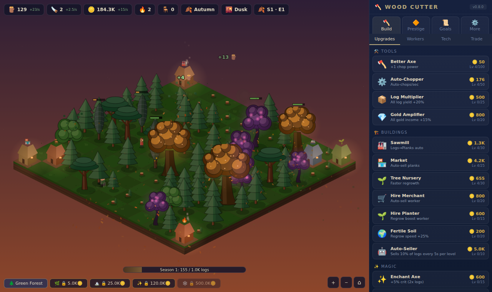

# 🪓 Wood Cutter

An isometric idle / incremental game about chopping wood. Fell trees, hire a crew, build a sawmill-to-export
production chain, research tech, and prestige through **Seasons → Eras → Epochs**.

**▶ Play:** https://tiredgoose.github.io/wood-cutter/ (installable as an offline app)



## Features

- Hand-drawn canvas isometric forest with 6 tree types, 5 biomes, day/night lighting and seasonal weather
- Workers with jobs: choppers fell trees, merchants sell at the market, planters tend stumps
- Processing chain: logs → planks → charcoal → furniture → luxury goods, with fluctuating market demand
- Tech tree, quests, timed contracts, trade routes, random events, boss trees, golden and ancient mutations
- Three prestige layers with an ascension tree and epoch perks
- Offline progress (50% for up to 8h; 100% for up to 24h with Timber Network)
- Autosave with a backup slot, plus export/import as a code or a file

## Controls

| Action | Mouse / keyboard | Touch |
| --- | --- | --- |
| Chop a tree | Click it | Tap it |
| Pan | Drag, or the arrow keys | Drag |
| Zoom | Wheel, or `+` / `-` (`0` resets) | Pinch |
| Sell logs / planks / charcoal / furniture / luxury | `S` `D` `F` `G` `H` | Build → Upgrades |
| Mute | `M` | More → Settings |

## Development

The game uses plain ES modules and has no build step. Open it through any static web server.

```sh
npm install        # dev tools only (vitest, vite, playwright)
npm run dev        # vite dev server with reload
npm test           # unit tests (simulation, saves, formatting)
npm run test:e2e   # browser smoke test in headless Chromium
npm run icons      # regenerate PNG icons from icons/favicon.svg
```

### Layout

| Path | What it does |
| --- | --- |
| `src/data.js` | Game content: upgrades, tech, achievements, quests, biomes, and more |
| `src/game.js` | The simulation. It has no DOM access, runs at a fixed 20 Hz step, and handles offline catch-up |
| `src/save.js` | Save migrations, Unicode-safe export codes, storage with a backup slot |
| `src/render.js`, `src/sprites.js` | Canvas renderer, camera and zoom, cached tree and ground sprites, particles, lighting |
| `src/ui.js` | HUD, shop panel (updated row by row), banners and modals |
| `src/input.js` | Pointer, wheel, pinch and keyboard input |
| `src/audio.js` | Synthesized Web Audio sound effects |
| `src/main.js` | Startup, main loop, save lifecycle, service worker registration |
| `sw.js`, `manifest.webmanifest` | Offline and installable app support (network-first cache) |

The simulation reports everything visible through `game.emit(type, data)`, for example `hit`, `fell`,
`notify` and `achievement`. The renderer and UI subscribe with `game.on(fn)`. That separation lets the
same `tick()` drive the live game, the offline catch-up and the tests.

When you add content, keep save compatibility. Bump `SAVE_VERSION` in `src/data.js` and add a step to
`migrateSave()` in `src/save.js`.

### Deployment

Pushing to `main` runs the tests and publishes the site to GitHub Pages
(`.github/workflows/pages.yml`). One-time setup: go to **Settings → Pages → Build and deployment →
Source** and choose **GitHub Actions**. When you change the list of files the game loads, bump `CACHE`
in `sw.js`.
